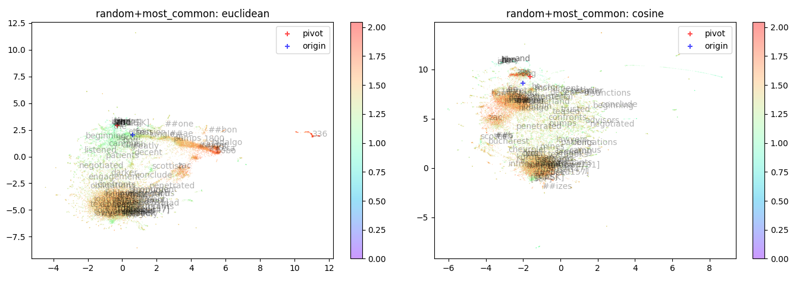
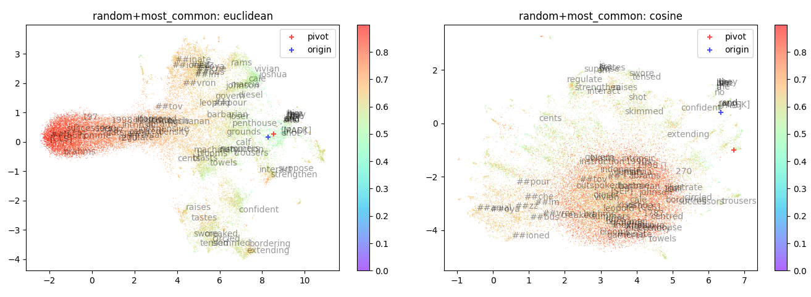
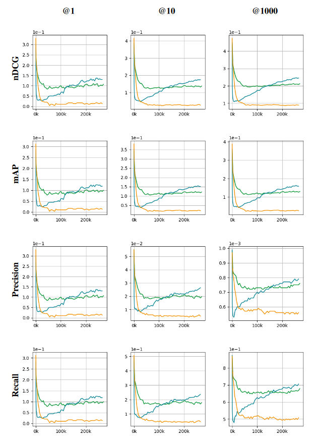

# Absolute BERT

這是儲存我[碩士論文](https://hdl.handle.net/11296/t57ba6)研究程式碼的 repo，研究方向是透過對 self-attention 算法上的調整，並比較預訓練中的一些設定，提出可以增加 BERT 模型可解釋性的一種可能改進的方向。

研究主要有以下發現：
1. 如果欲讓詞向量在空間中的相對位置能代表語意並有更好的一致性，在 MLM 預訓練任務輸出的對數機率中包含截距項參數是必要的。
1. 使用完整的 cross-entropy 而非採樣過的 sampled softmax loss 才能有效地將詞向量以字詞出現的頻率對應到相應的向量大小，讓詞向量之間在長度上具有對比。詞向量有正確的長度對應可以使後續運算的句向量具有類似使用詞頻進行加權的作用，也使得 "詞向量空間的各方向分別代表不同詞義" 更加合理。

Absolute BERT 分析原本 self-attention 的算法，並參考 [Roformer](https://arxiv.org/abs/2104.09864) 對於時間嵌入的做法，將 dot-product attention 拆分成只與時間有關的 *time attention* 還有 $\mathrm Q$、$\mathrm K$ 兩側字詞同時匹配的 *word pair matching* 運算。結果表示在這樣的結構下訓練出來的詞向量會均勻散佈於嵌入空間中，具有更好的一致性、可解釋性。

## 結果

使用 UMAP 對 BERT 與 Absolute BERT 所附帶的詞向量進行視覺化後，可以獲得下方的結果。可以發現 Absolute BERT 的詞向量以更均勻的方式對字詞進行編碼，不會有論文中發現的，不利於詞向量解釋性的結構產生。

上圖為使用 BERT 模型的詞向量，分別根據 euclidean distance 與 cos similarity，以 UMAP 方法繪製出的詞向量視覺畫圖。不同顏色的點各自代表不同大小的詞向量。
下圖使用了同樣的方法對 Absolute BERT 的詞向量進行視覺化。

實驗發現 Absolute BERT 使用了嵌入空間中更廣的角度，以更均勻的方式將字詞嵌入語意空間。

作為驗證，使用特定領域的 BEIR 資料集來比較語意空間的一致程度。在訓練的過程中，將 BEIR 中的 Scifact 資料集內的每個 query 與 texts 以平均的方式將詞向量進行運算以獲得句向量，並使用 cosine similarity 檢索出每個 query 可能對應的 text candidates，並計算四種指標獲得下圖。

上圖中的四種指標皆為越高越好，綠色線為 BERT 模型，藍色與橘色分別是以 cross entropy 與 sampled softmax loss 訓練的 Absolute BERT。可以發現在訓練一段時間後，Absolute BERT 的句向量擁有較好的結果。